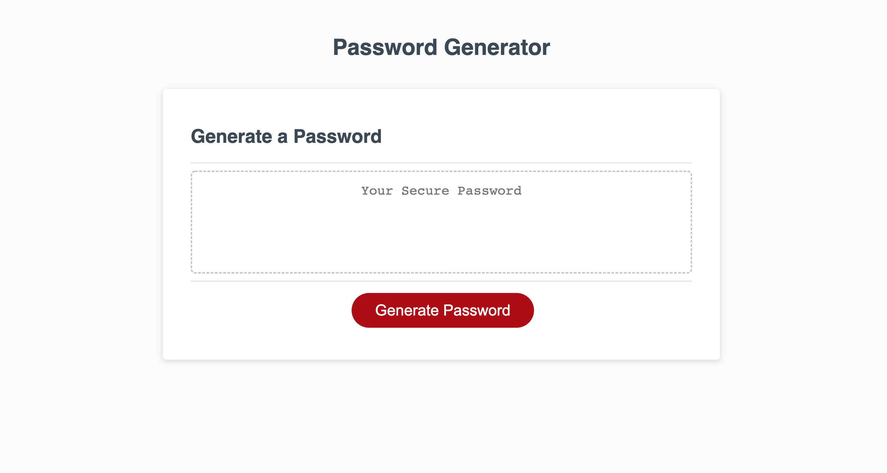

# Password-Generator

## Purpose
The purpose of this project was to create a randomly generated password based on selected criteria by the user.
The criteria included length (8-128 characters,) uppercase letters, lowercase letters, numbers and special characters.
The user was guided through a series of prompts to choose what criteria they wanted. 
Atleast one character type had to be selected or the user was prompted to try again.
After all prompts were answered, a password was displayed that met the criteria that the user selected.

## Technologies
HTML
CSS
JavaScript

## Webpage Display

## Website Link
https://kaysie04.github.io/Password-Generator/

## Licenses
MIT

